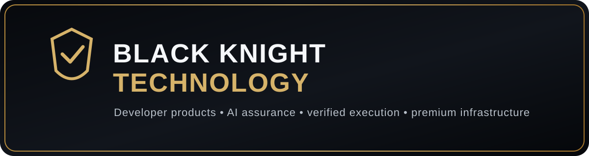

  

# Black Knight Technology

**Developer-first products for software readiness, evidence assurance, verified execution, and premium AI infrastructure.**

This public repository is the curated storefront for finished Black Knight Technology products. It contains public product information only. It does **not** contain private source code, credentials, deployment secrets, database access, or links that grant access to private repositories.

## Featured developer products

| Product | What it does | Positioning |
|---|---|---|
| [**RightsGate**](products/rightsgate.md) | Reviews AI-generated code provenance, OSS/dependency exposure, model/API usage, commercial-use signals, and software-readiness evidence. | Commercial readiness |
| [**ProofForge**](products/proofforge.md) | Produces evidence-focused assurance outputs for claims, reports, and agent decisions. | Evidence & assurance |
| [**TaskForge**](products/taskforge.md) | Structured task execution and payment-verified job workflows for machine-run services. | Verified execution |
| [**ACE — Autonomous Commerce Engine**](products/ace.md) | Premium assurance and autonomous commercial infrastructure for advanced operators. | Premium / enterprise |

## Why Black Knight Technology

- Built for commercial use, not demos only
- Clear product boundaries and customer-facing workflows
- Payment-connected fulfillment paths where enabled
- Developer-friendly product architecture
- Public storefront intentionally separated from private implementation repositories

## Storefront security model

VICKI26 is intentionally **static and public**. Public product pages may link to approved public landing pages or payment flows, but they do not embed privileged credentials or expose private repository paths.

Important boundaries:

- No Supabase service-role keys or private API keys
- No private GitHub repository tokens or internal clone URLs
- No environment files or production secrets
- No internal database connection strings
- No Crown IP, unpublished source, or proprietary implementation details
- No browser-side admin authority
- Private repositories remain private and independently permissioned

RLS belongs at the database/API layer, not inside a static GitHub README. Any linked application that uses Supabase must enforce its own RLS/authentication independently. This storefront does not bypass or weaken those controls.

See [STORE_SECURITY.md](STORE_SECURITY.md) for the public-storefront boundary.

## Other Black Knight offerings

Black Knight Technology also supports products and services outside the developer-focused catalog. Those offerings may use separate public landing pages and are intentionally kept secondary here so this repository remains developer-oriented.

## About the brand

See [BLACK_KNIGHT_TECHNOLOGY.md](BLACK_KNIGHT_TECHNOLOGY.md) for public company/brand information.

---

**Black Knight Technology**  
Developer Products • AI Assurance • Verified Execution • Premium Infrastructure
