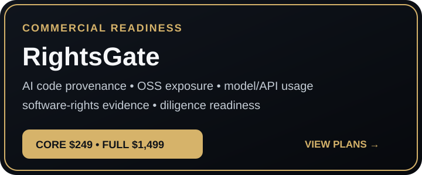
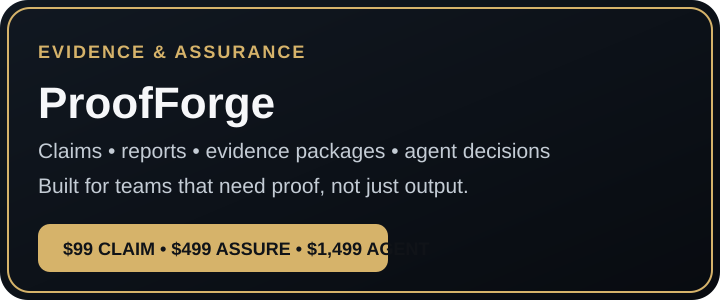
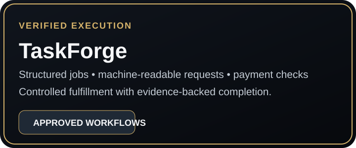
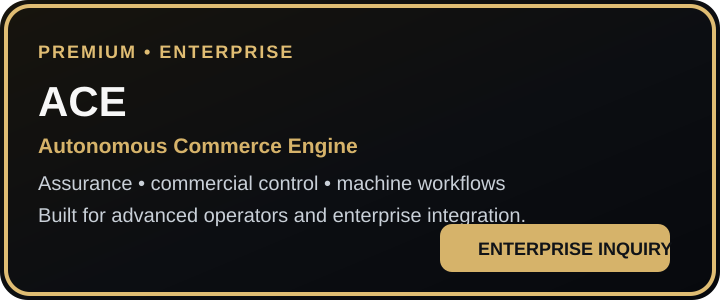

  

<h1 align="center">Black Knight Technology</h1>

  <strong>AI assurance, verified execution, and governed commerce infrastructure.</strong>

  <a href="products/rightsgate.md"><strong>Software Readiness</strong></a>
  &nbsp;•&nbsp;
  <a href="products/proofforge.md"><strong>Evidence Assurance</strong></a>
  &nbsp;•&nbsp;
  <a href="products/taskforge.md"><strong>x402 Services</strong></a>
  &nbsp;•&nbsp;
  <a href="products/ace.md"><strong>Enterprise A.C.E.</strong></a>

> **Start here:** Choose a product below, complete its approved Stripe or x402 payment path, and follow the secure intake instructions. Standard products route into their dedicated fulfillment workflows; enterprise A.C.E. engagements begin with qualification.

## Choose the right product

| If you need to… | Start with | Price | Purchase path |
|---|---|---:|---|
| Prepare AI-built software for launch, customers, licensing, or diligence | **RightsGate** | $249–$1,499 | [Compare plans](products/rightsgate.md) |
| Check claims, evidence packages, or an agent decision trail | **ProofForge** | $99–$1,499 | [View products](products/proofforge.md) |
| Run a bounded machine-readable audit or preflight | **TaskForge** | $0.01–$0.75 USDC | [Open $0.01 x402 endpoint](https://qaegxjxaavxdqihfgzhr.supabase.co/functions/v1/taskforge-x402-gateway) |
| License governed autonomous-commerce infrastructure | **A.C.E.** | Enterprise | [Request licensing](https://ace-dusky-iota.vercel.app/?source=github) |

**Payment rails:** Stripe for human-purchased reports and audits • USDC on Base for direct x402 execution  
**Merchant:** Black Knight Transportation LLC d/b/a Black Knight Technology

This public repository is the curated storefront for finished **Black Knight Technology** products. It contains public product information only—never private source code, credentials, deployment secrets, database access, or private-repository access.

## Featured products

### RightsGate
**by Black Knight Technology**

**✓ Live Checkout** · **✓ Production Intake Deployed** · **✓ Field Outreach Tested**

  

AI software-readiness audits for founders and teams preparing to commercialize AI-built software.

**Public plans:** $249 Core • $799 Commercial Readiness • $1,499 Full Readiness  
[Compare plans and purchase](products/rightsgate.md) • [Core checkout](https://book.stripe.com/7sY28kf627Bffh80Dyco001) • [Commercial checkout](https://book.stripe.com/eVq7sEbTQbRv5Gy0Dyco00r) • [Full checkout](https://book.stripe.com/7sYaEQ8HEg7L2umae8co00q)

---

### ProofForge
**by Black Knight Technology**

**✓ Live Checkout** · **✓ Paid Intake Deployed** · **✓ Fulfillment Worker Deployed**

  

Evidence-focused assurance for claims, reports, evidence packages, and agent decisions.

**Live products:** $99 Evidence Claim Check • $499 Evidence Assurance Report • $1,499 Agent Decision Audit  
[View ProofForge products and checkout links](products/proofforge.md)

---

### TaskForge
**by Black Knight Technology**

**✓ Runtime Exercised** · **✓ Marketplace Field-Tested** · **✓ Payment-Gated Execution**

  

Structured, machine-readable job execution with explicit scope, verification, and evidence-backed completion.

**Direct x402 catalog:** $0.01–$0.75 USDC per verified execution • No account or manual approval for standard catalog jobs  
[View services, prices, and payment endpoints](products/taskforge.md)

---

### A.C.E. — Autonomous Commerce Engine
**by Black Knight Technology**

**✓ Production Tested** · **✓ Fail-Closed Verified** · **✓ Enterprise Licensing Ready**

  

**Premium enterprise product.** Advanced assurance, commercial control, and governed autonomous machine-workflow infrastructure for sophisticated operators and integrations.

[View A.C.E.](products/ace.md) • [Request enterprise licensing](https://ace-dusky-iota.vercel.app/?source=github)

## What happens after purchase

| Product | Payment | Intake | Delivered result |
|---|---|---|---|
| RightsGate | Stripe | Secure project and repository intake | Software-readiness findings and remediation priorities |
| ProofForge | Stripe | Dedicated paid-intake workflow | Structured evidence or decision-assurance report |
| TaskForge | USDC on Base via x402 | Machine-readable request payload | Verified result with machine-readable completion evidence |
| A.C.E. | Controlled enterprise process | Qualification, agreement, and provisioning gates | Approved enterprise evaluation, license, or OEM engagement |

Delivery timing for human-reviewed products is confirmed after scope validation. A.C.E. access is never granted by viewing this public repository.

## Product proof

Black Knight Technology uses evidence-backed proof labels rather than unsupported marketing claims. Product badges reflect deployed infrastructure, repeatable system tests, fail-closed controls, marketplace activity, or verified workflow execution that has actually been observed.

[Review the Proof of Operation](PROOF_OF_OPERATION.md)

## Product map

| Product | Primary buyer | Best use case | Availability |
|---|---|---|---|
| **RightsGate** | Founders, SaaS teams, AI developers | Commercial-readiness and software-rights review | Public purchase |
| **ProofForge** | AI teams, operators, auditors | Evidence and decision assurance | Public purchase |
| **TaskForge** | Developers, agents, workflow operators | Verified structured execution | Direct x402 purchase |
| **A.C.E.** | Enterprise and advanced operators | Premium assurance and governed autonomous commerce | Enterprise engagement |

## Why Black Knight Technology

- One technology brand across the product portfolio
- Clear scope, pricing, payment, intake, and delivery paths
- Built for commercial use—not demonstrations alone
- Direct payment-to-fulfillment paths for standard catalog products
- Developer-friendly product architecture
- Evidence-backed proof labels tied to observed system behavior
- Public storefront intentionally separated from private implementation repositories

## Storefront security

VICKI26 is intentionally **static and public**. Public product pages may link to approved landing pages or payment flows, but they do not embed privileged credentials or expose private repository paths.

- No Supabase service-role keys or private API keys
- No private GitHub repository tokens or internal clone URLs
- No environment files or production secrets
- No internal database connection strings
- No Crown IP, unpublished source, or proprietary implementation details
- No browser-side administrative authority
- Private repositories remain independently permissioned

RLS belongs at the database and API layer, not inside a static GitHub README. Any linked application using Supabase must enforce its own RLS and authentication.

[Read the complete storefront security boundary](STORE_SECURITY.md)

## Company

Black Knight Technology is the customer-facing technology brand operated by **Black Knight Transportation LLC d/b/a Black Knight Technology**.

[About Black Knight Technology](BLACK_KNIGHT_TECHNOLOGY.md)

---

  <strong>Black Knight Technology</strong> 
  Developer Products • AI Assurance • Verified Execution • Premium Infrastructure

